<div align="center">
  

  <h1>VertexCRM</h1>
  <p><strong>One Platform. Every Customer. Complete Growth.</strong></p>

  <p>
    A premium marketing/product website for VertexCRM — a fictional 360° business operations CRM for Indian SMBs. Built as a Full Stack Developer Screening Task.
  </p>

  <p>
    <a href="https://vertex-crm-gamma.vercel.app/"></a>
    <a href="https://github.com/harshdodiya58/VertexCRM"></a>
  </p>

  <br />
</div>

<details open>
  <summary><b>Table of Contents</b></summary>
  <ol>
    <li><a href="#-tech-stack">🚀 Tech Stack</a></li>
    <li><a href="#-setup--installation">🛠 Setup & Installation</a></li>
    <li><a href="#-design-decisions">🎨 Design Decisions</a></li>
    <li><a href="#-information-architecture">📐 Information Architecture</a></li>
    <li><a href="#-ai-tools-used">🤖 AI Tools Used</a></li>
    <li><a href="#-acceptance-criteria-verified">📋 Acceptance Criteria</a></li>
    <li><a href="#-notes">📝 Notes</a></li>
  </ol>
</details>

---

## 🚀 Tech Stack

Crafted with modern web technologies to ensure lightning-fast performance, smooth animations, and type safety.

| Category | Technology |
|:---|:---|
| **Framework** |  (App Router) |
| **Language** |  (Strict Mode) |
| **Styling** |  (Custom Design Tokens) |
| **Scroll Animation** | **GSAP 3** + `@gsap/react` (`useGSAP`) + **ScrollTrigger** |
| **Component Animation** |  |
| **Smooth Scroll** | **Lenis** |
| **Charts** | **Recharts** |
| **Icons** | **Lucide React** |
| **Fonts** | **Inter** (Google Fonts via `next/font`) |
| **Deployment** |  |

---

## 🛠 Setup & Installation

Get the project running locally in just a few steps:

```bash
# 1. Clone the repository
git clone https://github.com/harshdodiya58/VertexCRM.git
cd VertexCRM

# 2. Install dependencies
npm install

# 3. Start the development server
npm run dev     # Starts server at http://localhost:3000

# 4. Build for production
npm run build   # Creates the production build
npm run start   # Serves the production build
```

---

## 🎨 Design Decisions

### 🌟 Why Light Theme?
The PRD calls for a **disciplined light theme** rather than the expected dark-SaaS-glassmorphism approach. While dark mode is a common reflex for "modern CRM" tools, a carefully executed light theme signals greater design maturity and feels more enterprise-trustworthy to HR/Finance buyers who live in light-mode tools (like Excel, Tally, or Google Sheets) every day.
> *The depth is achieved through layered soft shadows, precise 1px borders on surfaces, and accent-tinted shadows on hover.*

### 🎭 Motion Architecture
Two animation libraries are used with clearly separated responsibilities:
- **GSAP + ScrollTrigger:** Controls all scroll-driven sequences (e.g., Dashboard Showcase pin, SVG path draws, fill-line in Automation). GSAP owns anything that must sync perfectly with scroll progress.
- **Framer Motion:** Handles component-level interactions (e.g., mount/unmount via `AnimatePresence`, hover/tap micro-interactions, layout animations, testimonial pointer tilt). Framer owns anything responding to user interaction without scroll binding.

> 🛡️ **Accessibility First:** Both layers share a single `MotionPreferenceContext` that detects `prefers-reduced-motion` and disables animations universally—keeping logic DRY and accessible.

### ⚡ Performance Strategy
- **Code Splitting:** Heavy sections (Dashboard Showcase, Analytics charts) are dynamically imported with elegant skeleton fallbacks, keeping the initial JS bundle under the **250KB gzip** target.
- **Responsive Animations:** All pinned ScrollTrigger instances use `ScrollTrigger.matchMedia` to gracefully degrade to simple `IntersectionObserver`-driven fade+slide animations on mobile (preventing broken pin offsets).
- **Zero Layout Shift:** Fonts are strategically loaded via `next/font`.

---

## 📐 Information Architecture

```mermaid
graph LR
A(Navbar) --> B(Hero)
B --> C(Trusted By)
C --> D(Problem)
D --> E(Solution Transition)
E --> F(Core Features)
F --> G(Dashboard Showcase)
G --> H(Integrations)
H --> I(Automation)
I --> J(Analytics)
J --> K(Why Choose Us)
K --> L(Testimonials)
L --> M(Pricing)
M --> N(FAQ)
N --> O(Final CTA)
O --> P(Footer)
```


---

## 🛠️ List of AI Tools used :

| Tool | Antigravity (Claude Sonnet 4.6) |
|---|---|
| **Used for** | Full site scaffolding — component architecture, GSAP timelines, Framer Motion variants, design token implementation, and accessibility wiring. |
| **Why chosen** | Handles long-context PRDs efficiently, translating them into structured, well-typed TypeScript component trees without hallucination. |
| **% AI-assisted** | **~90%** (AI wrote the code, human authored the PRD and reviewed each section). |

---

## 📋 Acceptance Criteria Verified

### 🎨 Volume 2 (Design)
- [x] Every color used precisely maps to a CSS token from Volume 2.2 — **no ad-hoc hex values**.
- [x] Every spacing value strictly follows a **multiple of 8px**.
- [x] Every reusable UI element enforces a typed prop interface.

### ⚙️ Volume 3 (Architecture)
- [x] **No global state library** (no Redux/Zustand) — built entirely on `useState` + Context.
- [x] All GSAP animations utilize `useGSAP()` or `gsap.context()` for automatic, leak-free cleanup.
- [x] Dashboard Showcase is dynamically imported with a seamless skeleton fallback.

### ✨ Volume 5 (Experience & SEO)
- [x] Dashboard Showcase timeline precisely matches the Volume 5.3 sequence.
- [x] Every `pin: true` ScrollTrigger has a dedicated `matchMedia` mobile fallback.
- [x] `prefers-reduced-motion` is globally respected via `MotionPreferenceContext`.
- [x] JSON-LD `SoftwareApplication` structured data injected into `<head>`.
- [x] Fully functional `sitemap.ts` + `robots.txt` present.
- [x] Open Graph & Twitter Card metadata beautifully configured.

---

## 📝 Notes
- **FAQ Accordion:** Implements a **single-open** logic (only one item opens at a time) for simpler UX and reduced cognitive load.
- **Pricing Configuration:** ₹2,999 / ₹6,999 / Contact Sales — prominently featuring a 20% annual discount toggle.
- **Testimonial Engine:** Auto-rotates every 4 seconds, elegantly pauses on hover/focus, and is completely keyboard-navigable.
- **Forms:** All form validation is robustly handled client-side (no backend required); a refined success state is presented upon valid submission.

<br />

<div align="center">
  <sub>Built with ❤️ for Indian SMBs.</sub>
</div>
